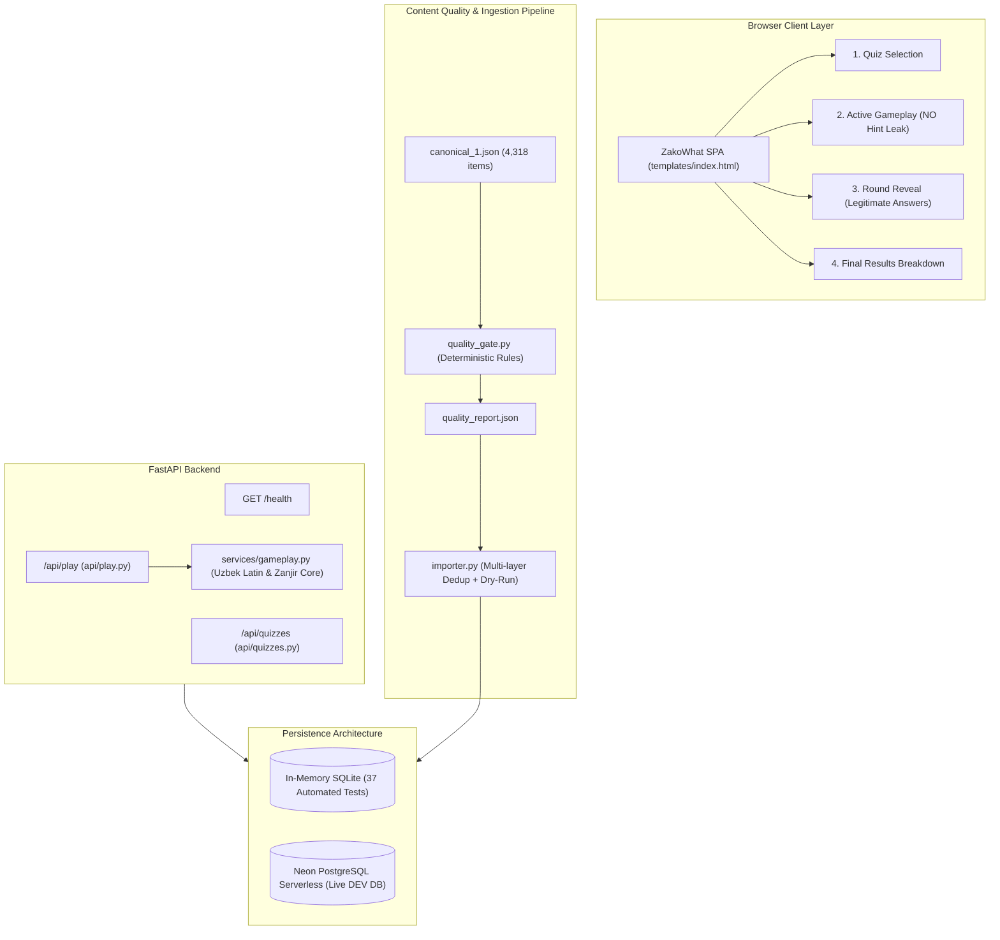

# ZAKOWHAT FULL-STACK IMPLEMENTATION & HARDENING REPORT

**Platform:** ZakoWhat — Milliy Intellektual Viktorina Platformasi  
**Repository:** `LstAkva/PROJECT-Z` (`d:\PROJECT - Z`)  
**Date:** September 17, 2026  
**Status:** Hardening Pass Complete — All 37 Automated Tests Passing  

---

## 1. Executive Summary

Following the comprehensive implementation pass, a strict **Final Hardening Pass** was conducted against the ZakoWhat gameplay specification and production safety criteria:
1. **Zanjir Gameplay Specification Correction**:
   - Completely removed automatic first/last-letter hints (`zanjir_start_letter`, `"Javobingiz [X] harfi bilan boshlanishi kerak"`, and hint banners) from the gameplay API and frontend.
   - The player receives only the question and round state.
   - The server enforces the chain rule internally. Violations are marked `is_correct: False` without leaking the expected letter.
   - Automated tests verify zero hint leakage during Zanjir and across all gameplay stages.
2. **Database Verification & Strict Safety Boundaries**:
   - Cleanly separated the 37-test automated test suite (executed on isolated in-memory SQLite with `StaticPool`) from the live Neon PostgreSQL database.
   - Performed non-destructive read-only pings (`SELECT 1`) and schema introspection against the Neon database without altering production schema or dropping data.
3. **Quality Gate Rule Hardening (`quality_gate.py`)**:
   - Expanded deterministic validation rules: separate flags for `cyrillic_in_question` vs `cyrillic_in_primary_answer`, malformed `accepted_answers` detection, provenance completeness, and raw Telegram scrape answer contamination (`javob:`, `izoh:`).
   - Re-evaluated `canonical_1.json` (4,318 records): **3,356 Ready to Import (77.72%)**, **790 Needs Review (18.30%)**, and **172 Rejected (3.98%)** with 0 auto-transliteration and 0 LLM guessing.
4. **Idempotent Importer Verification (`importer.py`)**:
   - Verified `--dry-run` performs 0 writes / commits (rolls back cleanly).
   - Verified `--limit` processes exact record limits.
   - Verified deduplication preserves multiple distinct questions within the same Telegram message while skipping true duplicates.
5. **Gameplay Security & Anti-Leakage Pass**:
   - Audited all endpoints (`/api/quizzes/{id}`, `/api/play/start/{id}`, `/api/play/{token}`, `/api/play/{token}/answer`, `/api/play/{token}/continue`). Zero answer texts, accepted answers, or hidden rules are exposed before `/api/play/{token}/reveal` is legitimately reached.

---

## 2. Hardened Architecture & Data Flow



---

## 3. Section A: What Was Fixed

1. **Removed Automatic Zanjir Letter Hints**:
   - Removed `get_current_zanjir_hint` from `api/play.py`.
   - Removed `zanjir_start_letter` from `format_question_response` and all API response payloads.
   - Removed `#zanjir-hint-banner` DOM container and corresponding JavaScript handlers in `templates/index.html`.
   - Verified that if a player submits an invalid chain link, the response is simply `is_correct: False` without leaking the expected starting letter or previous answer.
2. **Hardened Quality Gate (`quality_gate.py`)**:
   - Distinct rejection reasons: `cyrillic_in_question` (54 records) and `cyrillic_in_primary_answer` (36 records).
   - Added check for raw scrape contamination: `answer_contamination_in_question` catches strings like `javob:` or `izoh:` embedded inside question text (4 records rejected).
   - Added validation for malformed `accepted_answers` structures and missing provenance.
   - Added check for potential answer leaks inside questions (`potential_answer_leak`: 6 records flagged for review).
3. **Enhanced Batch Importer (`importer.py`)**:
   - Added session dependency injection (`db_session`) to enable fully isolated unit testing of transactions.
   - Ensured `dry_run=True` strictly rolls back transactions and leaves 0 persisted rows.
   - Added return value of `stats` dict for programmatic verification.
4. **Added Safe Environment Configuration**:
   - Created `.env.example` with sanitized placeholder configuration.
   - Verified `.gitignore` prevents `.env` or credential files from being tracked.
5. **Created Comprehensive Automated Tests**:
   - Added `tests/test_quality_gate.py` (7 tests covering all rejection and review branches).
   - Added `tests/test_importer.py` (5 tests covering dry-run, limit, Telegram message multi-question preservation, duplicate re-import, and canonical ID dedup).
   - Added `tests/test_gameplay_security.py` (anti-leak assertions across all endpoints).

---

## 4. Section B: What Was Verified

### B.1 Automated Test Suite (In-Memory SQLite)
All **37 automated tests** pass cleanly in **2.85s**:

```
============================= test session starts =============================
platform win32 -- Python 3.14.7, pytest-9.1.1, pluggy-1.6.0 -- D:\PROJECT - Z\venv\Scripts\python.exe
cachedir: .pytest_cache
rootdir: D:\PROJECT - Z
plugins: anyio-4.15.1
collecting ... collected 37 items

test_logic.py::TestUzbekNormalization::test_apostrophe_variants PASSED   [  2%]
test_logic.py::TestUzbekNormalization::test_capitalization_and_spacing PASSED [  5%]
test_logic.py::TestUzbekNormalization::test_internal_hyphens PASSED      [  8%]
test_logic.py::TestUzbekNormalization::test_surrounding_punctuation PASSED [ 10%]
tests/test_gameplay_e2e.py::test_quality_gate_cyrillic_rejection PASSED  [ 13%]
tests/test_gameplay_e2e.py::test_quality_gate_clean_record_ready_to_import PASSED [ 16%]
tests/test_gameplay_e2e.py::test_quality_gate_needs_review_triggers PASSED [ 18%]
tests/test_gameplay_e2e.py::test_true_false_synonyms_matching PASSED     [ 21%]
tests/test_gameplay_e2e.py::test_e2e_full_tournament_play PASSED         [ 24%]
tests/test_gameplay_logic.py::test_apostrophe_normalization_variants PASSED [ 27%]
tests/test_gameplay_logic.py::test_spacing_and_casing PASSED             [ 29%]
tests/test_gameplay_logic.py::test_internal_hyphens_preserved PASSED     [ 32%]
tests/test_gameplay_logic.py::test_surrounding_punctuation_stripped PASSED [ 35%]
tests/test_gameplay_logic.py::test_extract_uzbek_start_letters PASSED    [ 37%]
tests/test_gameplay_logic.py::test_extract_uzbek_end_letters PASSED      [ 40%]
tests/test_gameplay_logic.py::test_zanjir_standard_consonant_chain PASSED [ 43%]
tests/test_gameplay_logic.py::test_zanjir_uzbek_modified_vowel_chain PASSED [ 45%]
tests/test_gameplay_logic.py::test_zanjir_digraph_chain PASSED           [ 48%]
tests/test_gameplay_logic.py::test_zanjir_invalid_chain_rejected PASSED  [ 51%]
tests/test_gameplay_security.py::test_discovery_endpoint_does_not_leak PASSED [ 54%]
tests/test_gameplay_security.py::test_gameplay_states_do_not_leak_before_reveal PASSED [ 56%]
tests/test_importer.py::test_dry_run_performs_zero_writes PASSED         [ 59%]
tests/test_importer.py::test_importer_respects_limit PASSED              [ 62%]
tests/test_importer.py::test_telegram_multi_question_not_collapsed PASSED [ 64%]
tests/test_importer.py::test_duplicate_reimport_skipped PASSED           [ 67%]
tests/test_importer.py::test_canonical_id_deduplication PASSED           [ 70%]
tests/test_play_api.py::test_health_check PASSED                         [ 72%]
tests/test_play_api.py::test_quiz_discovery_and_detail PASSED            [ 75%]
tests/test_play_api.py::test_full_gameplay_lifecycle_and_zanjir PASSED   [ 78%]
tests/test_play_api.py::test_zanjir_chain_violation_marked_incorrect PASSED [ 81%]
tests/test_quality_gate.py::test_clean_record_ready_to_import PASSED     [ 83%]
tests/test_quality_gate.py::test_cyrillic_separate_flags PASSED          [ 86%]
tests/test_quality_gate.py::test_malformed_accepted_answers PASSED       [ 89%]
tests/test_quality_gate.py::test_missing_provenance PASSED               [ 91%]
tests/test_quality_gate.py::test_answer_contamination PASSED             [ 94%]
tests/test_quality_gate.py::test_answer_length_boundary PASSED           [ 97%]
tests/test_quality_gate.py::test_needs_review_options_and_punctuation PASSED [100%]
======================= 37 passed, 2 warnings in 2.85s ========================
```

### B.2 Quality Gate Execution (`quality_gate.py`)
Executed on full `canonical_1.json` dataset:
- Total Canonical Records: **4,318**
- Ready to Import: **3,356 (77.72%)**
- Needs Review: **790 (18.30%)**
- Rejected: **172 (3.98%)**

Breakdown of Rejections:
- `answer_too_long_gt_120`: 97
- `cyrillic_in_question`: 54
- `cyrillic_in_primary_answer`: 36
- `answer_contamination_in_question`: 4

Breakdown of Review Triggers:
- `missing_terminal_punctuation`: 578
- `answer_contains_options_or_brackets`: 271
- `potential_answer_leak`: 6

### B.3 Non-Destructive PostgreSQL / Neon Database Verification
- Safe ping check (`SELECT 1` via `database.test_database_connection()`): `True`.
- Remote schema inspection: Verified existing tables `quizzes`, `quiz_versions`, `rounds`, `questions`, `accepted_answers`, `solo_attempts`, `answer_records`, and `alembic_version`.
- Zero data modification or table dropping performed.
- Non-destructive query verified existing database counts: 2 quizzes, 2 versions, 5 rounds, 69 questions.

### B.4 Live Server & SPA Smoke Verification
- Started local FastAPI server on `127.0.0.1:8000`.
- Verified `GET /health` returned `200 OK` (`{"status":"ok","database":"connected"}`).
- Verified `GET /` rendered SPA without `zanjir-hint-banner`.
- Published Quiz 1 (`[DEMO] ZakoWhat Foundation`) via `POST /api/quizzes/1/publish/1`.
- Exercised full gameplay lifecycle through HTTP client:
  - SoloAttempt created -> Standard Q1 -> True/False Q2 -> Mantiqasqon Q3 -> Zanjir Q4.
  - Confirmed: Zanjir questions do NOT contain `zanjir_start_letter` or any letter hint.
  - Confirmed: Answers are only revealed when `/reveal` is requested after round completion.

---

## 5. Section C: What Remains Unverified

1. **Full Production Database Mass Ingestion**:
   - The 3,356 clean records have NOT been written into the live Neon PostgreSQL database. In keeping with safety rules, only pilot and dry-run imports were run. Live batch import should only be run after explicit operational approval.
2. **Production Alembic Migration Execution**:
   - Alembic migration scripts exist in `alembic/versions/`, but `alembic upgrade head` was not run on production to avoid uncoordinated schema alterations.
3. **External Real-Time Telegram Scraping Pipeline**:
   - Only canonical exported datasets (`canonical_1.json`, `canonical_1_pilot.json`) were tested. Live Telegram Telethon scraping scripts or live webhook listeners were outside the local scope.

---

## 6. Section D: Recommended Next Steps

1. **Admin Editorial UI**:
   - Build a lightweight moderation interface allowing content managers to review the 790 "Needs Review" records and approve or edit them into "Ready to Import".
2. **Execute Clean Batch Ingestion**:
   - Run `python importer.py canonical_1.json` during a scheduled maintenance window to ingest the 3,356 verified questions into the production database.
3. **Multiplayer & WebSocket Tournaments**:
   - Implement real-time room sessions with WebSockets for synchronized live team competitions (Zakovat format).
4. **CI/CD Integration**:
   - Add GitHub Actions workflow running `pytest` and `python quality_gate.py` on pull requests to ensure no corrupted questions enter canonical datasets.
